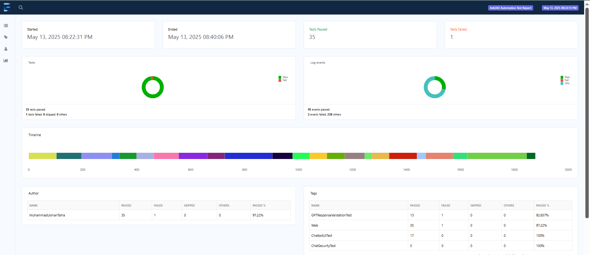

# Test Automation Framework for ask.u.ae

An end-to-end test automation framework built with Selenium, Java, TestNG, and ExtentReports for testing the ask.u.ae portal.

## Table of Contents

- [Overview](#overview)
- [Technologies](#technologies)
- [Framework Architecture](#framework-architecture)
- [Project Structure](#project-structure)
- [Setup Instructions](#setup-instructions)
- [Running Tests](#running-tests)
- [Reporting](#reporting)
- [Key Features](#key-features)
- [Best Practices](#best-practices)

## Overview

This framework provides a robust solution for automated testing of the ask.u.ae portal, implementing the Page Object Model design pattern. It offers parallel execution capabilities, comprehensive reporting, and screenshot capture on test failures.

## Technologies

- **Java:** Programming language
- **Selenium WebDriver:** Browser automation tool
- **TestNG:** Test execution framework
- **ExtentReports:** Reporting library
- **WebDriverManager:** Automated driver management
- **Maven:** Build and dependency management

## Framework Architecture

The framework follows the Page Object Model (POM) design pattern, which offers:

- **Separation of concerns:** Test code is separated from page objects
- **Reusability:** Page elements and methods are reusable across tests
- **Maintainability:** Changes to UI elements only need to be updated in one place
- **Readability:** Tests are concise and easy to understand

### Core Components

1. **BasePage:** Abstract class containing common page methods and WebDriver operations
2. **BaseTest:** Test setup, teardown, reporting, and screenshot capture
3. **Page Objects:** Representation of web pages with elements and actions
4. **Test Classes:** TestNG tests exercising application functionality
5. **Utility Classes:** Configuration, reporting, and helper methods

## Project Structure

```
selenium-testng-framework/
├── src/
│   ├── main/java/com/askuae/automation/
│   │   ├── base/
│   │   │   ├── BasePage.java
│   │   │   └── BaseTest.java
│   │   ├── pages/
│   │   │   └── ChatbotPage.java
│   │   └── utils/
│   │       ├── ConfigReader.java
│   │       ├── ExtentManager.java
│   │       └── TestReportUtils.java
│   └── test/
│       ├── java/com/askuae/automation/tests/
│       │   ├── ChatbotUITest.java
│       │   ├── ChatSecurityTest.java
│       │   └── GPTResponseValidationTest.java
│       └── resources/
│           ├── config.properties
│           └── testng.xml
├── report/
│   ├── screenshots/
│   └── extent-report.html
└── pom.xml
```

## Setup Instructions

1. **Prerequisites:**
   - Java JDK 11 or higher
   - Maven 3.6 or higher
   - IDE (Eclipse, IntelliJ IDEA, or VS Code)

2. **Clone the repository:**
   ```bash
   git clone [repository-url]
   cd selenium-testng-framework
   ```

3. **Install dependencies:**
   ```bash
   mvn clean install -DskipTests
   ```

4. **Configure the application URL:**
   - Open `src/test/resources/config.properties`
   - Update the `url` property if needed

## Running Tests

### Via Maven

Run all tests:
```bash
mvn clean test
```

Run a specific test class:
```bash
mvn clean test -Dtest=ChatbotUITest
```

### Via TestNG XML

Run the TestNG suite configured in `testng.xml`:
```bash
mvn clean test -DsuiteXmlFile=testng.xml
```

### Parallel Execution

Tests run in parallel by default across multiple classes. The thread count can be modified in the `testng.xml` file.
`<suite name="AskUAE Test Suite" parallel="methods" thread-count="3">`

### Bilangual Execution

The language can be modified in the `config.properties` file.
`lang=arabic && lang=english`

### Execution With Different Test Data

The test data can be modified in the `DataProviders.java` file.

## Reporting

After test execution, reports can be found at:
- **ExtentReports:** `report/extent-report.html`
- **Screenshots:** `report/screenshots/(*.png)`

## Key Features

1. **Cross-browser Testing:**
   - Chrome, Firefox, and Edge support
   - Configurable through TestNG XML

2. **Parallel Execution:**
   - Run tests in parallel to reduce execution time
   - Configurable thread count

3. **Failure Handling:**
   - Automatic screenshot capture on test failures
   - Integration with ExtentReports for clear failure analysis

4. **Page Object Model:**
   - Encapsulated page elements and actions
   - Method chaining for improved readability

5. **Utility Functions:**
   - Smart waits (explicit and implicit)
   - Browser session management
   - Configuration management

## Best Practices

- **Explicit Waits:** Always use explicit waits over Thread.sleep()
- **Test Independence:** Tests should be able to run independently of each other
- **Meaningful Assertions:** Use descriptive assertion messages
- **Data Separation:** Keep test data separate from test logic
- **Clean Teardown:** Ensure browser sessions are properly closed after tests

## Report Summary Visual

